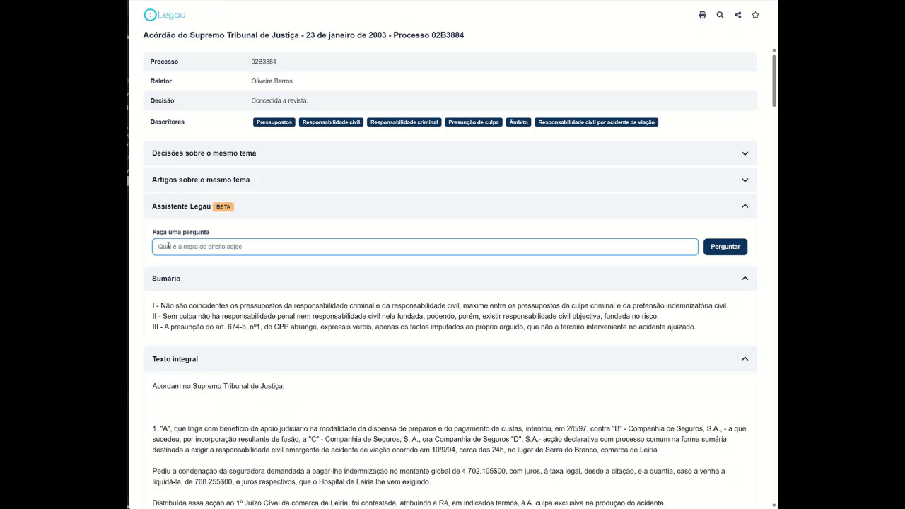

# Legau technical challenge

On this folder you find a Laravel 9.x project.

A development enviornment is also provided, cortesy of Laravel Sail - https://laravel.com/docs/9.x/sail#main-content

To run it, 

1. make sure you have docker installed in your system 
2. install the dependencies using composer[1] and 
3. setup the `.env` file: `cp .env.example .env`
3. then run: `./vendor/bin/sail up`.

[1] 
```
docker run --rm \
    -u "$(id -u):$(id -g)" \
    -v $(pwd):/var/www/html \
    -w /var/www/html \
    laravelsail/php81-composer:latest \
    composer install --ignore-platform-reqs
```

A database migration and some seed data is provided. Please migrate&seed.

The challenge is composed of two user stories:

# As a user, I want to read a court decision

(Given I already have the URL for it)

## Acceptance criteria

* Upon opening a URL on this project (`http://localhost/decisions/...`), the contents of a court decision are displayed.
* The page should be search-engine-friendly.

## Other notes

Besides the database schema and seed data, three models are also included in this project to get you started (Court, Tag, CourtDecision).

The blade file for the layout of the page is also available. (`resources/views/decision/decision.blade.php`).

You only need to setup a controller and a route.

# As a user, I want to ask questions regarding a given court decision and recieve results.



## Acceptance criteria

* The page with the court decision field has an input field with the label "Ask a question" and submit button
* By clicking the submit button, a request to a language model is sent that should answer the question.
* The answer from the langauge model should be given back to the user.

## Other notes

Use the GPT3 / 4 API. 

See more in https://platform.openai.com/docs/api-reference/chat

OpenAI Playground: https://platform.openai.com/playground

An API Key should be provided to you for this.

# Bonus points

Think how this codebase could be improved to have it production-ready.

What comes to your mind? Let us know.

-------------------------------------------------

If you have any questions or comments, feel free to reach out.

Please submit the results back via e-mail or create a private repository in any code sharing service of your choice and send an invite.